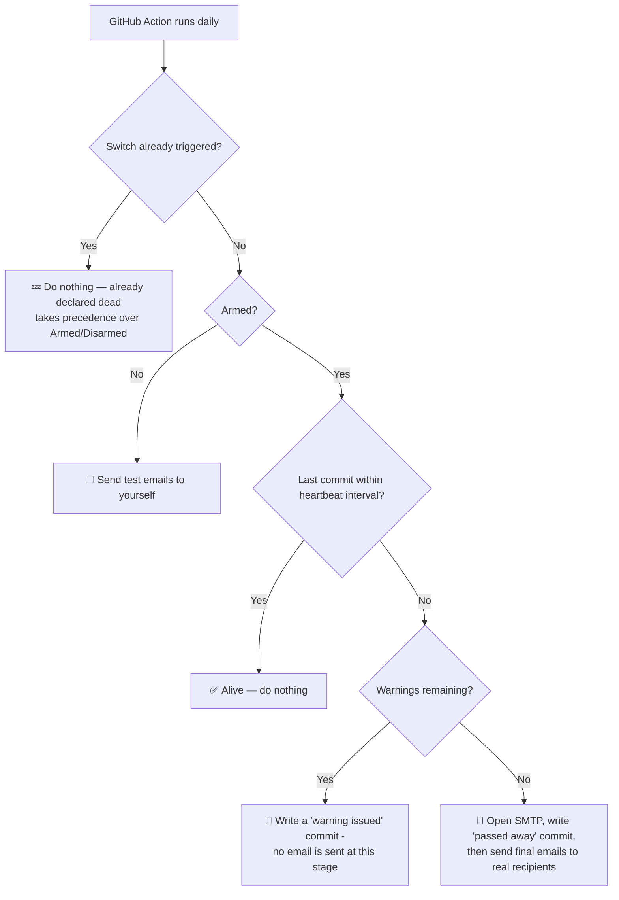

<div align="center">
  <h1>Dead Man's Switch</h1>
  <p>
    
    
  </p>
</div>

<p align="center">
  <em>“Just like Desmond in the hatch — check in every once in a while... or the switch will be triggered.”</em>
</p>


> **A free, private, and efficient dead man's switch emailer on GitHub**

*Ensuring your important messages reach the right people when it matters most.*

## 🎯 What is this?

A **dead man's switch** that monitors your GitHub activity and automatically sends emails to your chosen recipients if you go silent for too long. This is a digital safety net that ensures important communications reach your loved ones and handles critical matters when you cannot.

### 🔥 **Why This is the Best Dead Man's Switch Available:**

- **🆓 100% FREE** - Thanks to GitHub Actions free tier (compared to paid services that cost monthly)
- **🔧 NO DEPENDENCIES** - Pure Python stdlib; just use this as a template and configure the variables
- **🔒 ULTRA PRIVATE** - Your data never leaves GitHub (can run self-hosted actions for maximum privacy)
- **⚡ EFFICIENT** - Takes seconds to run, won't impact your GitHub Actions quota
- **🎨 FULLY CUSTOMIZABLE** - Write any emails you want, to anyone you want
- **📧 BROAD EMAIL SUPPORT** - Works with 11 major providers (Gmail, Outlook, iCloud, Yahoo, ProtonMail, Fastmail, Zoho, AOL, GMX, Mail.com, Yandex) across 18 domain aliases
- **📅 FLEXIBLE SCHEDULE** - Decide on how often to check for activity
- **⚠️ ESCALATION SYSTEM** - Configurable countdown of warning commits before the final trigger (note: warnings are silent — no warning *emails*, just commits to the repo)
- **🧪 TESTABLE** - Built-in test mode so you don't accidentally trigger it
- **🤖 MANUAL TESTING** - Test anytime with the GitHub Actions GUI; manual runs never advance state

## 🚀 Quick Start

### 1. Create Your Private Copy (Recommended)

```bash
# Click the "Use this template" button (green button next to "Fork")
# Select "Create a new repository" 
# Make sure to check "Private repository" for maximum confidentiality
# This ensures your configuration and messages remain completely private
# 
# Alternatively, you can fork the repository (which will be public)
# and use only repository secrets and variables in your emails
# You will still get confidential emails, but your configuration will be visible
```

> **Threat model:** the switch assumes you are the only person with push access. The bot identifies its own commits by matching both author name (`dms_bot`) AND email (`dms@bot.github.com`), which raises the bar for accidental collisions, but anyone with push access could deliberately impersonate the bot. **Use a private repository with no collaborators.** Also avoid enabling branch protection rules on the default branch — required reviews, signed commits, or restricted pushes will block the bot's own `git push` and prevent the switch from advancing through the warning ladder.

### 2. Customize Your Emails

We've provided some template examples in the `emails/` folder to get you started:

- `gf.txt.template` - For your significant other
- `will.txt.template` - For legal/official matters  
- `loan_shark.txt.template` - For special circumstances

**Important:** Any `.txt` file you place in the `emails/` folder will be sent as an email if the switch is triggered. Create as many as you need for different recipients and purposes. Templates will not be sent.

### 3. Set Up Repository Secrets

Go to your repository → Settings → Secrets and variables → Actions → New repository secret

**Required Secrets:**
- `MY_EMAIL` - Your email address (Gmail, Outlook/Hotmail, iCloud, Yahoo, ProtonMail, Fastmail, Zoho, AOL, GMX, Mail.com, Yandex supported — see the full table in the [Email Setup Guide](#-email-setup-guide))
- `MY_PASSWORD` - Your email app password (see [email setup guide](#-email-setup-guide))

> **Template variables in your emails:** Any `${VAR}` placeholder in your `emails/*.txt` files is substituted from repo secrets/variables. If a referenced var is **not set**, the run **fails loudly** rather than silently leaking the literal placeholder. Add every var you reference as a repo secret (sensitive) or variable (non-sensitive). The script reads from `os.environ`, which on a GitHub runner also contains ambient values like `GITHUB_ACTOR`, `RUNNER_OS`, `HOME`, and `PATH` — don't name your placeholders the same as these or substitution will pick up the runner's value instead.

### 4. Set Up Repository Variables

Go to Settings → Secrets and variables → Actions → Variables tab → New repository variable

**Required Variables:**
- `HEARTBEAT_INTERVAL` - Hours between required commits (minimum: 24)
- `NUMBER_OF_WARNINGS` - Silent warning commits before final trigger (recommended: 2). Each warning extends the deadline by one `HEARTBEAT_INTERVAL`. No email is sent on a warning — see [How It Works](#-how-it-works).
- `ARMED` - Set to `true` for live mode, `false` for testing

**Note:** These variables can also be edited directly in `.github/workflows/dms.yaml`. Repo variables override the workflow defaults; workflow_dispatch GUI inputs override both.

**Example Configuration:**
```
HEARTBEAT_INTERVAL = 336    # 2 weeks (recommended)
NUMBER_OF_WARNINGS = 2      # 2 silent warning commits (recommended)
ARMED = false               # Test mode (change to true when ready)
```

With the recommended settings (2 weeks + 2 warnings), your final emails will be sent approximately 6 weeks after your last commit. The rough formula is `HEARTBEAT_INTERVAL * (NUMBER_OF_WARNINGS + 1)`, plus up to one cron interval (24 h on the default schedule) per escalation — so the recommended config fires somewhere between 42 and 45 days after the owner's last commit.

### 5. Commit and Push (only if you customized templates locally)

If you cloned the repo locally and edited the `emails/*.txt` files there, push them now:

```bash
git add .
git commit -m "Set up my dead man's switch"
git push
```

If you did everything through the GitHub UI (created from template, edited the email files in the web editor, set secrets/variables in Settings), there's nothing local to commit — skip straight to **5b**.

### 5b. Verify everything works before relying on it

Before you trust the switch with anything important, trigger one manual run so you'll get the test emails delivered to yourself:

1. Go to the **Actions** tab → "Dead Man's Switch" workflow → **Run workflow**
2. **Leave `armed` set to `false`** for the verify run. That puts the switch in `DISARMED` mode, which sends one self-test email per `.txt` file *to your own MY_EMAIL*. This is the only state that reliably exercises the full send path.
3. Confirm you receive one test email per `.txt` file in your `emails/` directory.

> **About `armed=true` manual dispatch:** it's safe (manual dispatch never advances state), but its behavior depends on what state your repo is in. If you just pushed a heartbeat, the state is `ALIVE` and the run prints `"No action needed"` with no email sent — *not* a sign of failure, just a no-op. If you've let enough time pass to reach `ISSUE_WARNING` or `PASSED_AWAY`, the run parses templates and exercises SMTP (redirected to your own address). Most users should stick with `armed=false` for the verify step.

If any `${VAR}` placeholder is unset, any template is malformed, or `MY_EMAIL`/`MY_PASSWORD` is missing, the run fails loudly with an actionable error. The same checks run at every warning step under armed mode — so a setup error surfaces at warning #1, not at PASSED_AWAY weeks later when nobody is around to fix it.

**🎉 Done!** Your dead man's switch is now active!

### 6. Sending Heartbeat Commits

To keep the dead man's switch from triggering, you need to commit to the repository at least once every `HEARTBEAT_INTERVAL` hours. The commit message can be anything you want, here are two examples:

```bash
# Example 1.
git commit --allow-empty -m "Heartbeat"
git push
```

```bash
# Example 2.
git commit --allow-empty -m "4 8 15 16 23 42"
git push
```
## 📧 Email Template Format

Create `.txt` files in the `emails/` folder. The parser is strict:
- Lines before the first blank line are headers (`key: value` format)
- `To:` and `Subject:` are both required, and may not appear twice
- Everything after the first blank line is the body
- `${VAR}` placeholders anywhere in the file are substituted from repo secrets/variables; **missing vars fail the run**
- A bare `$` (e.g. `"You owe me $5"`, `"$HOME"`, regex `$` anchors) is left as literal text — only the `${IDENT}` form triggers substitution
- Placeholder names must match `[A-Za-z_][A-Za-z0-9_]*` (the same constraint GitHub already enforces on repo variable/secret names). `${dash-name}` or `${space inside}` is silently left as literal text — by design.
- UTF-8 with or without BOM is fine; CRLF line endings are normalized
- **Only `To:` and `Subject:` are recognised.** `Cc:`, `Bcc:`, `Reply-To:`, and any other header lines are silently dropped. If you want to send the same body to multiple recipients, create one `.txt` file per recipient (the switch sends them as separate emails).

Here are examples from the provided templates:

### Personal Message Example (from gf.txt.template)
```
To: gf@gmail.com
Subject: Oops, I did it again

Hey Babe,

OK, don't freak out. You're reading this probably because I'm dead or I forgot to turn off my dead man's switch again.

Hopefully it's the latter, so just text me saying that I'm a dumbass and that I forgot to turn off my dead man's switch.
If it's the former though, I'm sorry that I'm literally ghosting you. I hope it wasn't one of those accidents like in Final Destination.

My laptop password is ${LAPTOP_PASSWORD}. You know what to do.

Here is also something I want no one but you to know:
${SECRET_MESSAGE_TO_GF}

Please look after our dog, he's a good boy. Also wear pink to my funeral.
See you in another life.

P.S. I love you.
```

### Special Circumstances Example (from loan_shark.txt.template)
```
To: ${LOAN_SHARK_EMAIL}
Subject: I'm a dead man

Hey,

You said I'll be a dead man if I don't pay you back. Well, I hate to break the news but I'm actually a dead man.

You can collect the 5 grand I owe you from my bff ${PERSON_I_HATE_THE_MOST}, he'll be good for it.

Keep the change.
```

### Legal/Official Example (from will.txt.template)
```
To: saul.goodman@shady-law.com
Subject: I'm dead

Hey, I'm dead. I have 200 bucks in my bank account.
I want you to give that and also all my stuff to my girlfriend. You can reach her at ${GF_EMAIL}.

Thank you for your service,
Like you always said: "It's all good, man."
```

### Required Template Variables (for the shipped examples)

If you copy any of the shipped `.txt.template` files to `.txt` and run with `ARMED=true`, the strict-substitution parser will fail at runtime if any of these are unset. Add them as **repo variables** (non-sensitive — like email addresses) or **repo secrets** (sensitive — like passwords). Or just delete the lines that reference them.

| Template               | Vars referenced                                   | Treat as |
| ---------------------- | ------------------------------------------------- | -------- |
| `gf.txt.template`      | `LAPTOP_PASSWORD`, `SECRET_MESSAGE_TO_GF`         | Secret   |
| `will.txt.template`    | `GF_EMAIL`                                        | Variable |
| `loan_shark.txt.template` | `LOAN_SHARK_EMAIL`, `PERSON_I_HATE_THE_MOST`   | Variable |

### Environment Variable Examples

Add more secrets/variables to customize your templates:

```
To: ${GF_EMAIL}
Subject: ${EMERGENCY_SUBJECT}

Important information is stored in ${SECRET_LOCATION}.
Contact ${IMPORTANT_CONTACT} for assistance.

The password for my accounts is ${BACKUP_PASSWORD}.
```

## ⚙️ Configuration Options

### Heartbeat Interval
- **Minimum:** 24 hours (due to cron job in GitHub Actions)
- **Recommended:** 336 hours (2 weeks)
- **Maximum:** Whatever timeframe works for your situation

### Warning System
- **0 warnings:** Immediate final emails when deadline missed (if you think people are after you)
- **2 warnings:** Recommended for most users (~6 weeks total with 2-week heartbeat — see the timing note next to step 4)
- **4+ warnings:** If you're really forgetful

### Resetting the switch after a false-positive fire

Once a `passed away` commit lands on `main`, the switch enters
`ALREADY_DECLARED_DEAD` permanently — daily crons become no-ops. This is
intentional (it prevents a *second* mortality storm if the owner pushes
again after a vacation false-positive). To clear it you have to manually
rewrite history.

> **⚠️ Strongly consider disabling the workflow first** (Actions tab → "Dead
> Man's Switch" → "Disable workflow"). If you force-push the terminal
> commit away and leave the workflow on, the next time you're offline
> long enough the switch will fire *again* — sending mortality emails to
> people who already grieved last time. The no-revival invariant is
> there for a reason; the recipe below is the escape hatch, not the
> recommended path.

```bash
# 1. Find every bot-authored commit (warnings + passed away). Use exact
# author matching — `--author=dms_bot` alone is a substring filter that
# would also match contributors named e.g. "alice_dms_bot".
git log --pretty=format:'%H %an %s' main \
  | awk -F' ' '$2 == "dms_bot" {print $1, $0}'

# 2. Drop ALL bot commits from the branch in one rebase. Cherry-pick
# every non-bot commit on top of the last owner-authored commit. The
# easiest spelling is:
LAST_OWNER_SHA=$(git log --pretty=format:'%H|%an' main \
  | awk -F'|' '$2 != "dms_bot" {print $1; exit}')
git checkout -B main "$LAST_OWNER_SHA"

# 3. Force-push.
git push --force-with-lease origin main

# 4. Push a fresh heartbeat (otherwise the switch's first cron run after
# reset would immediately see the owner as inactive again).
git commit --allow-empty -m "Heartbeat after reset"
git push
```

If you only drop the terminal `passed away` commit but leave the prior
`warning issued` commits in place, the next cron will see them as
already-accrued warnings and could re-fire PASSED_AWAY within a single
cron *without* going through the warning ladder again. Dropping every
bot commit (step 2 above) is the only safe reset.

### Armed vs Test Mode
- **Test Mode (`ARMED=false`):** Sends emails to you only for testing
- **Armed Mode (`ARMED=true`):** Sends emails to recipients if you are inactive for the amount of time you specify in `HEARTBEAT_INTERVAL` in combination with `NUMBER_OF_WARNINGS`.

## 🔧 Email Setup Guide

### Supported Email Providers

This dead man's switch supports **11 major email providers** across 18 domain aliases out of the box:

| Provider            | Domains                       | Notes                                                                                 |
| ------------------- | ----------------------------- | ------------------------------------------------------------------------------------- |
| **Gmail**           | gmail.com                     | Recommended — requires app password                                                   |
| **Outlook/Hotmail** | outlook.com, hotmail.com      | Microsoft's email service (same SMTP host)                                            |
| **iCloud**          | icloud.com, me.com, mac.com   | Apple's email service                                                                 |
| **Yahoo**           | yahoo.com                     | Classic email provider                                                                |
| **ProtonMail**      | protonmail.ch, protonmail.com | ⚠️ Direct SMTP won't work — ProtonMail requires the local Bridge daemon or paid SMTP tokens. Set MY_EMAIL to your ProtonMail address but point MY_PASSWORD at the Bridge token. |
| **Fastmail**        | fastmail.com                  | Requires app-specific password                                                        |
| **Zoho**            | zoho.com, zohomail.com        | Different SMTP for personal (zoho.com) vs. pro (zohomail.com)                         |
| **AOL**             | aol.com                       | Classic email provider                                                                |
| **GMX**             | gmx.com, gmx.net              | German email service                                                                  |
| **Mail.com**        | mail.com                      | Free email with many domains                                                          |
| **Yandex**          | yandex.com, yandex.ru         | Russian email service                                                                 |

All providers use SMTP with TLS encryption on port 587.

### Gmail Setup (Recommended)
1. Enable 2-Factor Authentication
2. Generate an App Password:
   - Google Account → Security → 2-Step Verification → App passwords
   - Generate password for "Mail"
3. Use your Gmail address for `MY_EMAIL`
4. Use the app password (not your regular password) for `MY_PASSWORD`

### Other Providers
**Supported:** Outlook, iCloud, Yahoo, Hotmail, ProtonMail, Fastmail, Zoho, AOL, GMX, Mail.com, Yandex

Most providers don't require app passwords, but it's recommended for security. Enable 2FA and generate app passwords where available for best practices.

**Special Notes:**
- **ProtonMail:** Requires either ProtonMail Bridge (for personal use) or SMTP tokens (for business accounts)
- **Fastmail:** Requires app-specific passwords for third-party applications
- **Zoho:** Different SMTP servers for personal (@zoho.com) vs. business (custom domain) accounts

## 🎮 How to Test

### GitHub Actions GUI
1. Go to Actions tab in your repository
2. Click "Dead Man's Switch" workflow
3. Click "Run workflow"
4. Enter test parameters (or leave them blank to use the workflow defaults)
5. Click "Run workflow"

> **Manual runs never advance state.** A manual dispatch is automatically tagged as `--manual-dispatch`:
> - It can use a sub-24h heartbeat interval (the validation is bypassed)
> - It will send emails *to you* even if the switch is armed
> - It will **not** write `warning issued` or `passed away` commits, so you can test the armed flow without bricking the real switch.

## 📊 How It Works


```mermaid
graph TD
    A[GitHub Action runs daily] --> D{Switch already triggered?}
    D -->|Yes| E[💤 Do nothing — already declared dead<br/>takes precedence over Armed/Disarmed]
    D -->|No| B{Armed?}
    B -->|No| C[📧 Send test emails to yourself]
    B -->|Yes| F{Last commit within heartbeat interval?}
    F -->|Yes| G[✅ Alive — do nothing]
    F -->|No| H{Warnings remaining?}
    H -->|Yes| I[📝 Write a 'warning issued' commit -<br/>no email is sent at this stage]
    H -->|No| J[📮 Open SMTP, write 'passed away' commit,<br/>then send final emails to real recipients]
```

> **Important:** Warning steps create a commit in the repo; they do **not** send you an email. If you want to be notified the countdown is in progress, watch the repo's commit history or the Actions runs.

## 🛡️ Privacy & Security Features

### 🔒 **Maximum Privacy**
- **Private Repository:** Your configuration stays confidential
- **No External Services:** Everything runs on GitHub's infrastructure
- **Self-Hosted Option:** Run on your own GitHub Actions runner for ultimate privacy
- **No Data Collection:** We don't see or store anything

### 🔐 **Security Best Practices**
- Uses app passwords (not your main email password)
- Environment variables for sensitive data
- 100% pytest-covered Python with explicit error handling on every git/SMTP boundary
- Git-based authentication (no API keys stored)
- Reserved env var names (PATH, HOME, GITHUB_TOKEN, etc.) are refused if you accidentally use them as repo variable names

## 📈 Advanced Usage

### Custom Schedules
Edit `.github/workflows/dms.yaml` to change checking for activity frequency (not to be confused with the heartbeat interval):

```yaml
# Every day at 9 AM UTC (default)
schedule:
  - cron: '0 9 * * *'

# Every Monday at 6 PM UTC  
schedule:
  - cron: '0 18 * * 1'
```

### Environment Variables for Dynamic Content

Add repository secrets/variables for dynamic email content:

```
LAPTOP_PASSWORD=your_password
SECRET_LOCATION=safe_deposit_box_123
BACKUP_CONTACT=trusted_friend@email.com
IMPORTANT_DOCUMENTS=location_details
```

## 🎯 Example Scenarios

### The Active Developer
```
HEARTBEAT_INTERVAL = 168   # 1 week (commits regularly)
NUMBER_OF_WARNINGS = 1     # One warning is sufficient
ARMED = true               # Live operation
```

### The Regular User  
```
HEARTBEAT_INTERVAL = 336   # 2 weeks (recommended)
NUMBER_OF_WARNINGS = 2     # Standard warnings (recommended)
ARMED = false              # Testing phase
```

### The Cautious User
```
HEARTBEAT_INTERVAL = 168   # 1 week
NUMBER_OF_WARNINGS = 4     # Multiple chances if forgetful
ARMED = true
```

## 🆚 Comparison with Alternatives

| Feature           | This Project                                       | Paid Services              | DIY Solutions          |
| ----------------- | -------------------------------------------------- | -------------------------- | ---------------------- |
| **Cost**          | 🆓 FREE                                             | 💰 Monthly Fees             | 🔧 Time investment      |
| **Privacy**       | 🔒 100% Private                                     | 👁️ Data collection concerns | 🛡️ Depends on setup     |
| **Reliability**   | ⚡ GitHub's 99.9% uptime or your self-hosted runner | 📊 Varies                   | 🎲 Your server's uptime |
| **Setup Time**    | ⏱️ 5 minutes                                        | 📄 Forms + payment          | 🔨 Hours/days           |
| **Customization** | 🎨 Extensive (also on your repository)              | 📋 Templates only           | 🎯 Full control         |
| **Testing**       | ✅ Built-in                                         | 💸 Often costs extra        | 🧪 You build it         |

## 🤝 Contributing

Want to improve this project? 

1. Fork the repository
2. Create a feature/issue/bug branch
3. Add your features/fixes
4. Submit a pull request

**Ideas for contributions:**
- Any bug fixes or improvements (PRs welcome)
- Support for additional email providers if needed (currently supports 11 providers across 18 domain aliases)
- Slack/Discord notifications (On your repository)
- Mobile app integration (On your repository)
- Webhook support (On your repository)
- Advanced scheduling options (On your repository)

## 📜 License

MIT License - Open source for everyone's benefit.

## ⚠️ Legal Disclaimer

This is a software tool, not legal advice. For actual wills and legal matters, please consult with qualified professionals. This tool is designed to help with personal communications and reminders, not replace proper legal documentation.

---

**Remember:** This tool ensures your important communications reach the right people when you cannot deliver them yourself.

*Built with care for when it matters most*
