<div align="center">
  <h1>Dead Man's Switch</h1>
  <p>
    
    
  </p>
</div>

<p align="center">
  <em>“Just like Desmond in the hatch — check in every once in a while... or the switch will be triggered.”</em>
</p>


> **A free, private, and efficient dead man's switch emailer on GitHub**

*Ensuring your important messages reach the right people when it matters most.*

## 🎯 What is this?

A **dead man's switch** that monitors your GitHub activity and automatically sends emails to your chosen recipients if you go silent for too long. This is a digital safety net that ensures important communications reach your loved ones and handles critical matters when you cannot.

### 🔥 **Why This is the Best Dead Man's Switch Available:**

- **🆓 100% FREE** - Thanks to GitHub Actions free tier (compared to paid services that cost monthly)
- **🔧 NO DEPENDENCIES** - Just fork the repository and configure the variables
- **🔒 ULTRA PRIVATE** - Your data never leaves GitHub (can run self-hosted actions for maximum privacy)
- **⚡ EFFICIENT** - Takes seconds to run, won't impact your GitHub Actions quota
- **🎨 FULLY CUSTOMIZABLE** - Write any emails you want, to anyone you want
- **📅 FLEXIBLE SCHEDULE** - Decide on how often to check for activity
- **⚠️ WARNING SYSTEM** - Configurable warnings before the final trigger
- **🧪 TESTABLE** - Built-in test mode so you don't accidentally trigger it
- **🤖 MANUAL TESTING** - Test anytime with GitHub Actions GUI with workflow dispatch

## 🚀 Quick Start

### 1. Fork This Repository (Private Fork Recommended)

```bash
# Click the "Fork" button and make sure to check "Private repository"
# This ensures your configuration and messages remain confidential
# You can also make a public fork and use only repository secrets and variables in your emails
# You will still get 100% confidental emails
```

### 2. Customize Your Emails

We've provided some template examples in the `emails/` folder to get you started:

- `gf.txt.template` - For your significant other
- `will.txt.template` - For legal/official matters  
- `loan_shark.txt.template` - For special circumstances

**Important:** Any `.txt` file you place in the `emails/` folder will be sent as an email if the switch is triggered. Create as many as you need for different recipients and purposes. Templates will not be sent.

### 3. Set Up Repository Secrets

Go to your forked repository → Settings → Secrets and variables → Actions → New repository secret

**Required Secrets:**
- `MY_EMAIL` - Your email address (Gmail, Outlook, iCloud, Yahoo, Hotmail supported)
- `MY_PASSWORD` - Your email app password (see [email setup guide](#-email-setup-guide))

### 4. Set Up Repository Variables

Go to Settings → Secrets and variables → Actions → Variables tab → New repository variable

**Required Variables:**
- `HEARTBEAT_INTERVAL` - Hours between required commits (minimum: 24)
- `NUMBER_OF_WARNINGS` - Warning emails before final trigger (recommended: 2)  
- `ARMED` - Set to `true` for live mode, `false` for testing

**Note:** These variables can also be edited directly in the `dms.yaml` workflow file.

**Example Configuration:**
```
HEARTBEAT_INTERVAL = 336    # 2 weeks (recommended)
NUMBER_OF_WARNINGS = 2      # 2 warning emails (recommended)
ARMED = false               # Test mode (change to true when ready)
```

With the recommended settings (2 weeks + 2 warnings), your final emails will be sent after 6 weeks of inactivity. So quick way to calculate the total time until the final emails are sent is `HEARTBEAT_INTERVAL * (NUMBER_OF_WARNINGS + 1)`. But you can configure these variables to your liking.

### 5. Commit and Push

```bash
git add .
git commit -m "Set up my dead man's switch"
git push
```

**🎉 Done!** Your dead man's switch is now active!

### 6. Sending Heartbeat Commits

To keep the dead man's switch from triggering, you need to commit to the repository at least once every `HEARTBEAT_INTERVAL` hours. The commit message can be anything you want, here are two examples:

```bash
# Example 1.
git commit --allow-empty -m "Heartbeat"
git push
```

```bash
# Example 2.
git commit --allow-empty -m "4 8 15 16 23 42"
git push
```
## 📧 Email Template Format

Create `.txt` files in the `emails/` folder. Here are examples from the provided templates:

### Personal Message Example (from gf.txt.template)
```
To: gf@gmail.com
Subject: Oops, I did it again

Hey Babe,

OK, don't freak out. You're reading this probably because I'm dead or I forgot to turn off my dead man's switch again.

Hopefully it's the latter, so just text me saying that I'm a dumbass and that I forgot to turn off my dead man's switch.
If it's the former though, I'm sorry that I'm literally ghosting you. I hope it wasn't one of those accidents like in Final Destination.

My laptop password is ${LAPTOP_PASSWORD}. You know what to do.

Here is also something I want no one but you to know:
${SECRET_MESSAGE_TO_GF}

Please look after our dog, he's a good boy. Also wear pink to my funeral.
See you in another life.

P.S. I love you.
```

### Special Circumstances Example (from loan_shark.txt.template)
```
To: ${LOAN_SHARK_EMAIL}
Subject: I'm a dead man

Hey,

You said I'll be a dead man if I don't pay you back. Well, I hate to break the news but I'm actually a dead man.

You can collect the 5 grand I owe you from my bff ${PERSON_I_HATE_THE_MOST}, he'll be good for it.

Keep the change.
```

### Legal/Official Example (from will.txt.template)
```
To: saul.goodman@shady-law.com
Subject: I'm dead

Hey, I'm dead. I have 200 bucks in my bank account.
I want you to give that and also all my stuff to my girlfriend. You can reach her at ${GF_EMAIL}.

Thank you for your service,
Like you always said: "It's all good, man."
```

### Environment Variable Examples

Add more secrets/variables to customize your templates:

```
To: ${GF_EMAIL}
Subject: ${EMERGENCY_SUBJECT}

Important information is stored in ${SECRET_LOCATION}.
Contact ${IMPORTANT_CONTACT} for assistance.

The password for my accounts is ${BACKUP_PASSWORD}.
```

## ⚙️ Configuration Options

### Heartbeat Interval
- **Minimum:** 24 hours (due to cron job in GitHub Actions)
- **Recommended:** 336 hours (2 weeks)
- **Maximum:** Whatever timeframe works for your situation

### Warning System
- **0 warnings:** Immediate final emails when deadline missed (if you think people are after you)
- **2 warnings:** Recommended for most users (4 weeks total with 2-week heartbeat)
- **4+ warnings:** If you're really forgetful

### Armed vs Test Mode
- **Test Mode (`ARMED=false`):** Sends emails to you only for testing
- **Armed Mode (`ARMED=true`):** Sends emails to recipients if you are inactive for the amount of time you specify in `HEARTBEAT_INTERVAL` in combination with `NUMBER_OF_WARNINGS`.

## 🔧 Email Setup Guide

### Gmail Setup (Recommended)
1. Enable 2-Factor Authentication
2. Generate an App Password:
   - Google Account → Security → 2-Step Verification → App passwords
   - Generate password for "Mail"
3. Use your Gmail address for `MY_EMAIL`
4. Use the app password (not your regular password) for `MY_PASSWORD`

### Other Providers
**Supported:** Outlook, iCloud, Yahoo, Hotmail

Most providers don't require app passwords, but it's recommended for security. Enable 2FA and generate app passwords where available for best practices.

## 🎮 How to Test

### GitHub Actions GUI
1. Go to Actions tab in your repository
2. Click "Dead Man's Switch" workflow
3. Click "Run workflow" 
4. Enter test parameters
5. Click "Run workflow"

## 📊 How It Works

```mermaid
graph TD
    A[GitHub Action Runs Daily] --> B{Armed Mode?}
    B -->|No - Test Mode| C[📧 Self Test Emails]
    B -->|Yes| F{Check Last Commit}
    F -->|Recent Activity| G[✅ Active - Do Nothing]
    F -->|No Activity| H{Warnings Left?}
    H -->|Yes| I[⚠️ Self Warning Email & Create Warning Commit]
    H -->|No| J[📮 Send Final Emails & Create Final Commit]
```



## 🛡️ Privacy & Security Features

### 🔒 **Maximum Privacy**
- **Private Repository:** Your configuration stays confidential
- **No External Services:** Everything runs on GitHub's infrastructure
- **Self-Hosted Option:** Run on your own GitHub Actions runner for ultimate privacy
- **No Data Collection:** We don't see or store anything

### 🔐 **Security Best Practices**
- Uses app passwords (not your main email password)
- Environment variables for sensitive data
- Type-safe Python code with full error handling
- Git-based authentication (no API keys stored)

## 📈 Advanced Usage

### Custom Schedules
Edit `.github/workflows/dead-mans-switch.yml` to change checking for activity frequency (not to be confused with the heartbeat interval):

```yaml
# Every day at 9 AM UTC (default)
schedule:
  - cron: '0 9 * * *'

# Every Monday at 6 PM UTC  
schedule:
  - cron: '0 18 * * 1'
```

### Environment Variables for Dynamic Content

Add repository secrets/variables for dynamic email content:

```
LAPTOP_PASSWORD=your_password
SECRET_LOCATION=safe_deposit_box_123
BACKUP_CONTACT=trusted_friend@email.com
IMPORTANT_DOCUMENTS=location_details
```

## 🎯 Example Scenarios

### The Active Developer
```
HEARTBEAT_INTERVAL = 168   # 1 week (commits regularly)
NUMBER_OF_WARNINGS = 1     # One warning is sufficient
ARMED = true               # Live operation
```

### The Regular User  
```
HEARTBEAT_INTERVAL = 336   # 2 weeks (recommended)
NUMBER_OF_WARNINGS = 2     # Standard warnings (recommended)
ARMED = false              # Testing phase
```

### The Cautious User
```
HEARTBEAT_INTERVAL = 168   # 1 week
NUMBER_OF_WARNINGS = 4     # Multiple chances if forgetful
ARMED = true
```

## 🆚 Comparison with Alternatives

| Feature           | This Project                                       | Paid Services              | DIY Solutions          |
| ----------------- | -------------------------------------------------- | -------------------------- | ---------------------- |
| **Cost**          | 🆓 FREE                                             | 💰 Monthly Fees            | 🔧 Time investment      |
| **Privacy**       | 🔒 100% Private                                     | 👁️ Data collection concerns | 🛡️ Depends on setup     |
| **Reliability**   | ⚡ GitHub's 99.9% uptime or your self-hosted runner | 📊 Varies                   | 🎲 Your server's uptime |
| **Setup Time**    | ⏱️ 5 minutes                                        | 📄 Forms + payment          | 🔨 Hours/days           |
| **Customization** | 🎨 Extensive (also on your fork)                    | 📋 Templates only           | 🎯 Full control         |
| **Testing**       | ✅ Built-in                                         | 💸 Often costs extra        | 🧪 You build it         |

## 🤝 Contributing

Want to improve this project? 

1. Fork the repository
2. Create a feature/issue/bug branch
3. Add your features/fixes
4. Submit a pull request

**Ideas for contributions:**
- Any bug fixes or improvements (PRs welcome)
- Support for more email providers if needed (PRs welcome)
- Slack/Discord notifications (On your fork)
- Mobile app integration (On your fork)
- Webhook support (On your fork)
- Advanced scheduling options (On your fork)

## 📜 License

MIT License - Open source for everyone's benefit.

## ⚠️ Legal Disclaimer

This is a software tool, not legal advice. For actual wills and legal matters, please consult with qualified professionals. This tool is designed to help with personal communications and reminders, not replace proper legal documentation.

---

**Remember:** This tool ensures your important communications reach the right people when you cannot deliver them yourself.

*Built with care for when it matters most*
